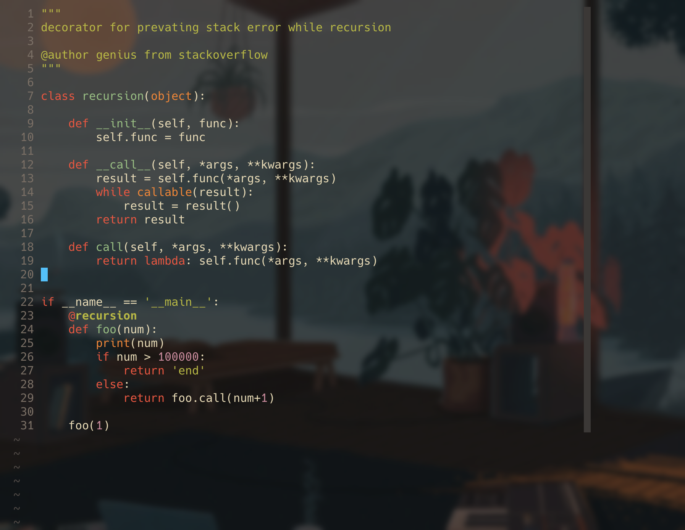

Hello everyone. This is my custom configuration for neovim.
It is based on configuration of [Alexey Goloburdin](https://github.com/alexey-goloburdin) . But have some changes.

This is how it looks on Mac OS with Warp terminal emulator.



### Installation

* Download the init.vim
* Put it into folder `~/.config/nvim/`
* Install also [vim-plug](https://github.com/junegunn/vim-plug) — plugin manager for vim/nvim.
  For Linux it can be done by
  ```
  sh -c 'curl -fLo "${XDG_DATA_HOME:-$HOME/.local/share}"/nvim/site/autoload/plug.vim --create-dirs \
         https://raw.githubusercontent.com/junegunn/vim-plug/master/plug.vim'
  ```
